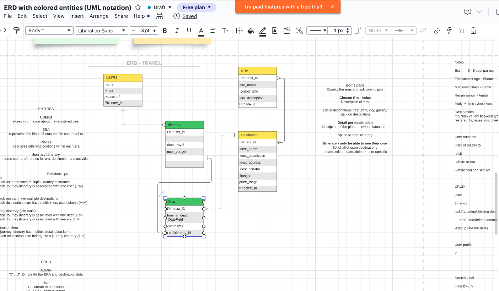
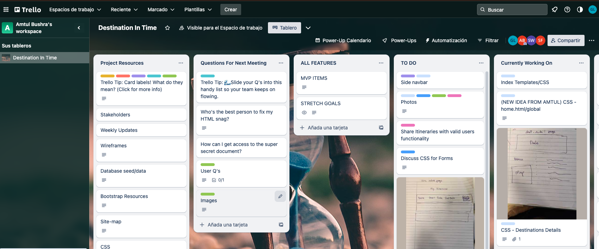
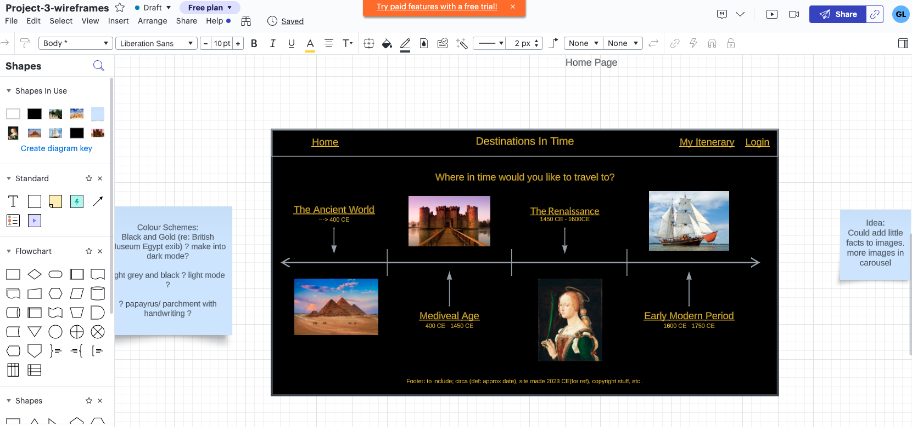
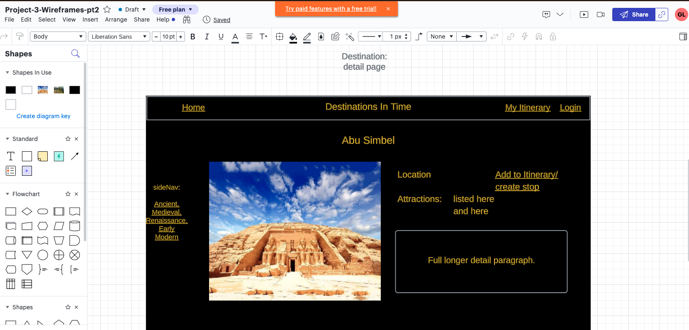
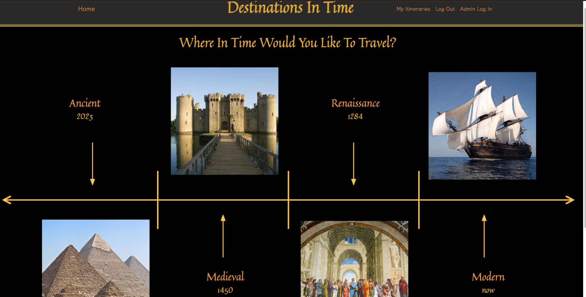

# **Project 3 Destinations in Time**

## **Unit 3: Full-stack group collaboration.**

### **We are using Django to develop a Full-stack project as we were asked to have a full-stack web app where the main focus is relational databases (using PostgreSQL) and… Working as a team!**

### Divided into small groups, the challenge is developing a collective idea, planning and collaborating towards a final product. Helping each other, giving ideas, debugging as a team and dealing with Git/GitHub.

# **The App**
## **[Destinations In Time](**~https://destinationsintime-8b0d7ccc414f.herokuapp.com/~**)<!-- {"preview":"true"} -->**

### **Goals**
- Having an MVP by the end of the week.
- Work in a small group and complete a project beyond the scope of what any one idividual could achive on their own.
- Have fun and try not to throw any computers out of a window.

### **Tools**
- Django
    - Python framework for full-stack development.

- Crispy
    - Used to format Django's built in forms with the help of their template packs.

- PostgreSQL
    - Relational databases. In this particular project, we must have at least one 1:M and one M:M relationship

- Bootstrap and CSS
    - Override Bootstrap for forms and overall page to look better and more user-friendly design.

- Heroku
    - Deployed page on Heroku so that the website is available to all users.

## Overview of the journey

ERD for the project. Core and heart of the functionality.

--- 

Trello board for the project manager to keep track and assign tasks for the team.

---

Wireframes for how the pages were initially pictured.

---

Final home page

---

# **How it works.**

**The main focus of our app is to create a holiday planner. Not just an ordinary one but one where the user can choose the historical era that is more interesting to them.** 

A user can create an itinerary with different stops. They can have multiple itineraries.

Inside that chosen era, the user could choose from several worldwide destinations that might interest them.

The user can browse, decide which destinations are more suitable for their wanted experience for particular dates, and save that option as a Stop inside an itinerary on their profile.

From the user’s perspective, itineraries and stops can be created, updated or deleted.

**Conception of the project, problems, solutions and tricky parts.**

Having a great team and communication is the key to a positive outcome. Our group consists of a team of 4 developers. 

As a group project, the idea came during a brainstorming session and after the initial discussions, we started to divide the roles and tasks, and they were summarized as follows:
    
    - Project Manager: Keep everyone on track, delegate and assign tasks and deadlines. 
    - Front End Developer: Work and create the pages’ wireframes, layouts and style.
    - Back-end: Make everything work behind curtains, database, rendering functions 
    - Full-stack: going back and forth, helping in any needed area.

Using a Trello board and having constant communication with each other made things easier for everyone. 

All of us collaborate on every step of the project. Even with defined roles, we actively helped, debugged and coded anywhere that was needed. However, we all knew our roles. The project manager prioritised tasks according to our timelines, and we respected each other’s work.

## **No project is exempt of problems…**

- GIT/GITHUB:
    - Working in a collaborative environment is challenging. One of the main problems (at the beginning) was dealing with pushing and pulling data to and from Git and Git Hub. This was resolved by practicing constantly and refering back to previous lessons.

- Databases:
    - Using relational databases is different from MongoDB. Even with the ERD done is easy to lose track of the relations and how everything is connected. At some point a mistake was made regading the relations between tables, causing a circular problem.

- Bootstrap and CSS:
    - We used Bootstrap to have some uniformity and easiness over forms and overall style. Dealing with it and overriding it proved to be challenging. However the practice allowed us to focus on locating the correct methods to achive our goals.

- Troubleshooting:
    - As part of the task, we were asked to try and debug amongst ourselves while working as a team. It was not an easy task at some points (and we needed to seek help from the instructors a couple of times when things were beyond our abilities), but overall, we dealt with most troubles as a team.

## **Challenges, Highlights, Future Plans**

## **Worst of the Worst:**
- Git and Github can be tricky to work with. However, it is one of the main tools a developer must know and master.
- Relational databases require more planning in advance since they don't adapt as well to change. 
- Finding a balance between using Bootstrap and writing our own custom CSS.
- Sharing code on GoogleDocs. It changes indentation and rearranges punctuation that is important to coding.

## **Memorable Moments:**
- TEAMWORK! Managing to solve problems without having to got to the instructors was a point of pride for the group.

## **Stretch goals and wishes for the project:**

The medium-term goal will be to transform the site into an entire e-commerce site where the user can book accommodation or tours thanks to potential clients (hotels, museums, restaurants) having their info or destinations on our site, waiting to connect to potential users. 

On that note, clients can create, update or delete their own goals and show them on the social media platform of thier choice (after passing a moderator filter to align with the standards and the site's theme). Users can get direct information and deals from the sites/destinations, leave reviews about them, post pictures and leave suggestions to other travellers.

The first steps to achieve that will be implementing some APIs like Google Maps (to find the exact location of the destinations), booking.com (to book accommodation closest to the destination) and assorted APIs that gives information about history and/or art. Additionaly, there were plans to implement the functionality of a calendar or a trip planner, that could be shared over social media or email.

# **Thanks, everyone!**
Sincerely…

The Historical Developers Collective Time Travel Agency

